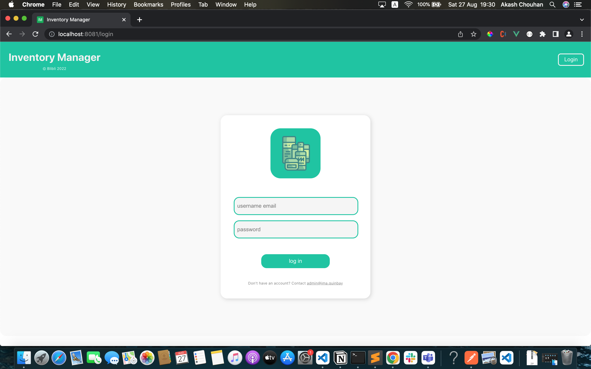
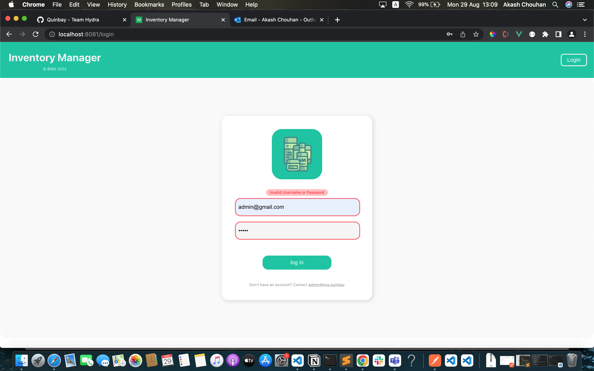
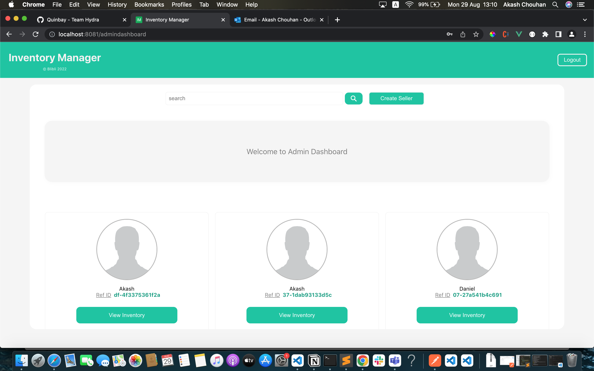
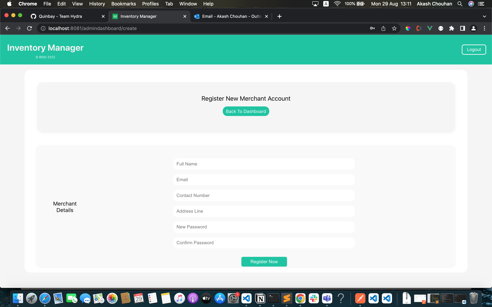

# Inventory Manager Application (IMA - UI) 

**Team: Hydra**

### Contributors
* **[Akash Chouhan](mailto:akash.chouhan@quinbay.com)**
* **[Daniel Nielson](mailto:daniel.nelson@quinbay.com)**

---
### Use Case
* **Inventory Manager** has the provision to supervise the merchant/seller traffic on your e-commerce site.
    * Admin can register new sellers on the site.
    * Admin has the access to the current inventory status of each and every registered seller.
    * Admin user can enable or disable sellers.
    * Admin can gauge the estimated profit from specific sellers.
* Sellers can use their credentials to validate themselves againts the IMA auth microservice and they would be exposed to seller's dashboard
* Seller can add, delete or update their stock status.

### Project setup

**Installation**
1. Install Node.js version 14
2. Clone the repository
    ```
        git clone https://github.com/quinbay-cbj/IMA-Frontend.git
    ```
3. **cd** into the directory
4. Install all dependencies
    ```
     npm install --save
    ```
    
5. Run the development server for vue application

*  Compiles and hot-reloads for development
    ```
    npm run serve
    ```
* Compiles and minifies for production
    ```
    npm run build
    ```
* Lints and fixes files
    ```
    npm run lint
    ```

* Customize configuration
    See [Configuration Reference](https://cli.vuejs.org/config/).

---
### UI Preview

* **Login**
    
* **Validations**
    
* **Admin Dashboard**
    
* **Create Seller/Merchant**
     
